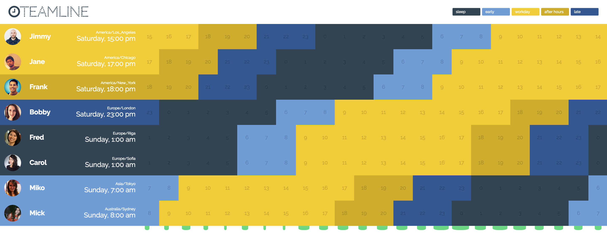

teamline
=======================================

A simple tool for finding best meeting times for distributed teams.

Details
---------------------------------------
Allows custom settings for availability and a clear view of what times work
best for the majority of the team distributed across many timezones.

In the future, it would be great to integrate this into existing apps/services
which deal with teams and already posess timezone & scheduling data.

Todo
---------------------------------------
- [] Add user-specific availablity
- [] Add user filtering
- [] Add groups feature to quickly filter specific users
- [] Consider service integrations
    - [] Slack user info (name, timezone, avatar...etc)
    - [] Google On Air
    - [] Google Calendar
    - [] Asana Tickets
    - [] Build Doodle
- [] Add "sacrifice counter" for each individual. This would be used for balancing extreme meeting times for any one user. 

Reference
---------------------------------------
- [Orig Prototype](https://jsbin.com/xekubo/edit?html,css,js,output)
- [Extracting Slack User Data](https://gist.github.com/kasparsd/f8f36794ecf558915d6f)

#### Inspired by:
- doodle.com
- http://www.timeanddate.com/worldclock/meetingtime.html?p1=136&p2=48&p3=176&p4=240&p5=224&p6=213&iv=0
- http://everytimezone.com/
- https://github.com/alisdair/team-time-zone-backend